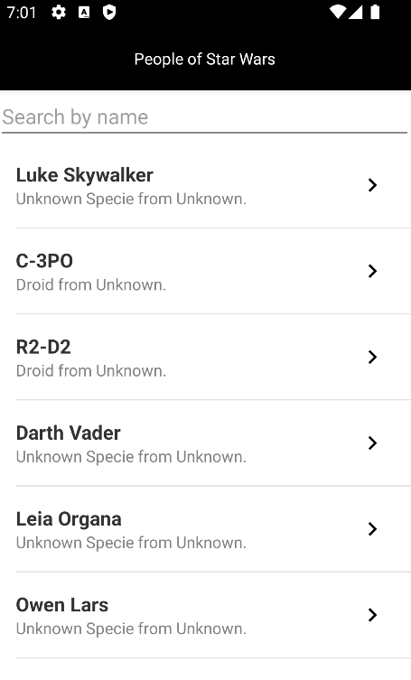
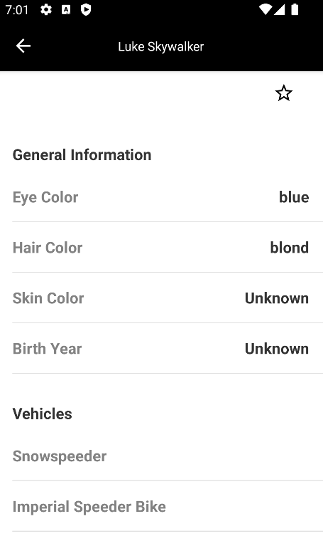
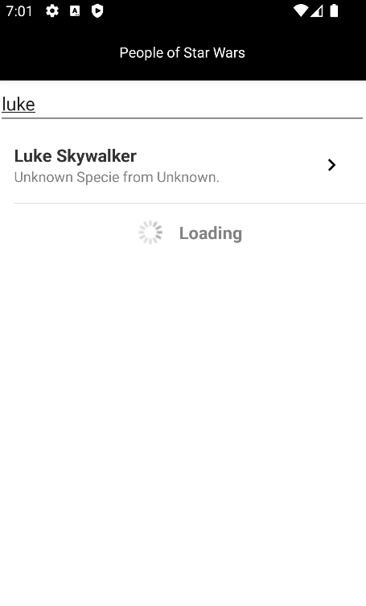

# Ravn-Challenge-V3-Hector-Saravia

This app allows you to browse characters that the Star Wars GraphQL Api provides and save favorite
characters.

## Getting Started

## Prerequisites

To run this app, you will need to have Android Studio installed.

## Installing

1. Clone this repository.
2. Open the project in Android Studio.
3. Build and run the app on your device or emulator.

## Screenshots.

## Any assumptions you made during the project if necessary. Additional information.

## Technologies.

This project was built using the following technologies:

- kotlin
- android jetpack
- apollo graphQL
- koin